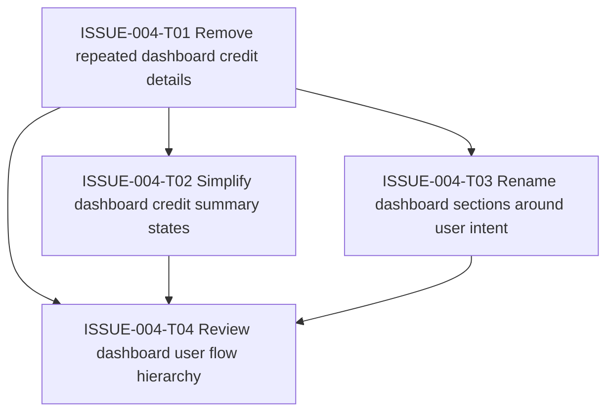

# ISSUE-004 Task Graph

## Order Rationale

Start by removing duplicate credit detail so the remaining dashboard content is easier to reason about. Then simplify the summary states and rename the dashboard sections. Finish with a broader flow review once the content and vocabulary are stable.

## Resolution

All ISSUE-004 tasks were completed on 2026-05-30. The dashboard now leads with account credit state, renders only Available/In use/Used, removes repeated row-level credit details, and uses content-based sections for Active Cohorts & Schedule, Created Cohorts, and Interested Cohorts.
