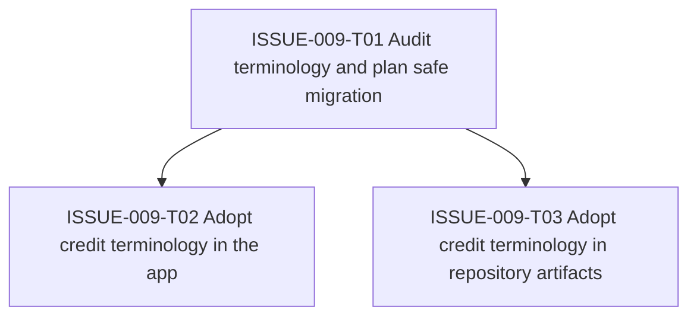

# ISSUE-009 Task Graph

## Execution Notes

All ISSUE-009 tasks were completed on 2026-06-13. The resolver performed a repo-wide terminology migration, renamed app and workflow artifacts to credits, added durable local JSON compatibility normalization, and verified the result with focused tests, workflow checks, and full project checks.
