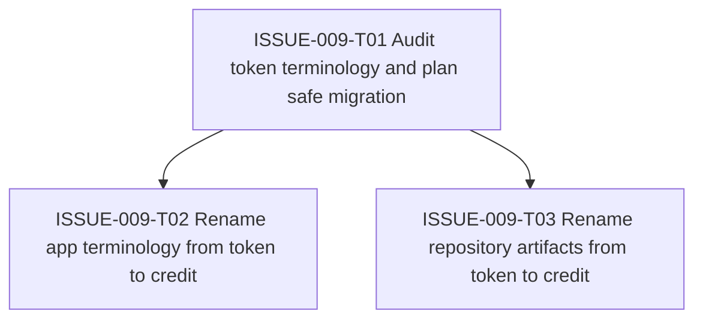

# ISSUE-009 Task Graph

## Execution Notes

Start with the terminology audit because this issue crosses code, tests, docs, and historical workflow artifacts. App terminology and repository artifact updates can proceed after the migration map is clear, but closeout should verify the whole repo together.
